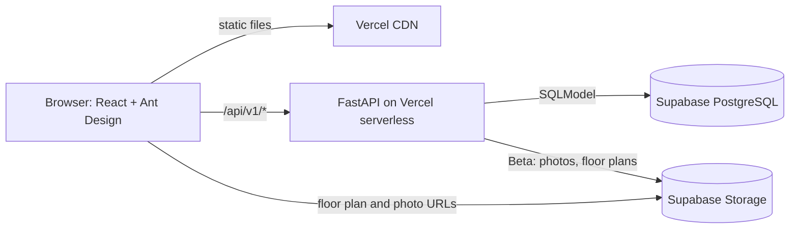
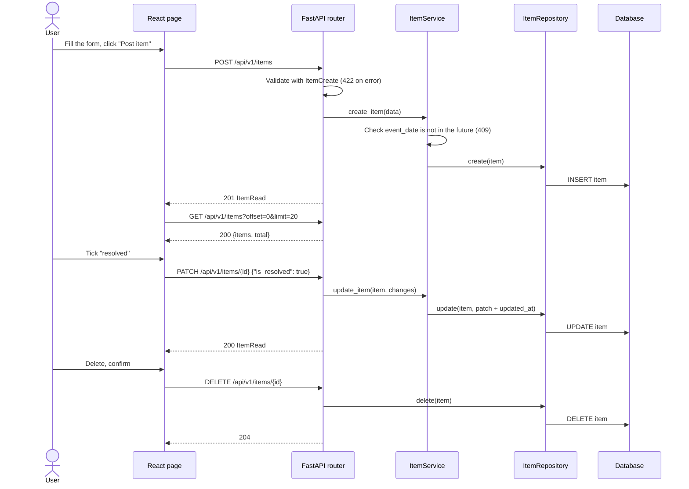
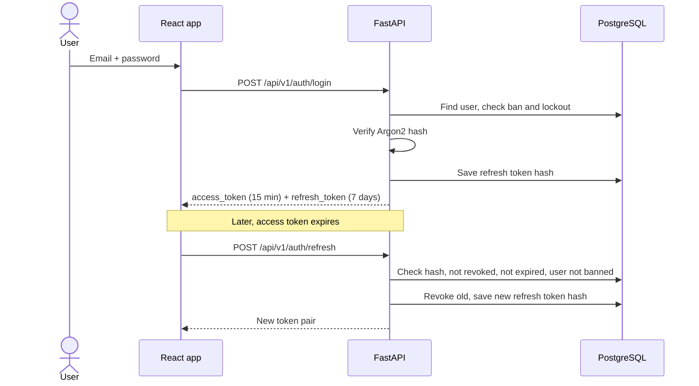
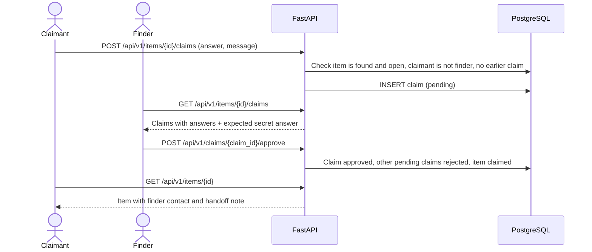
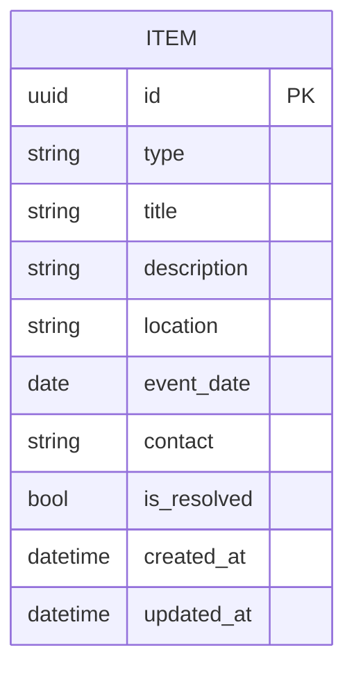
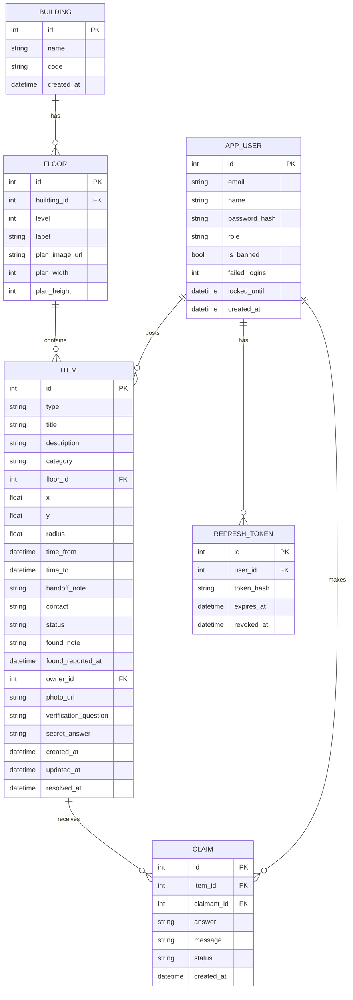

# Technical Design Document (TDD): LostSpot

| | |
|---|---|
| **Product** | LostSpot |
| **Document** | Technical Design Document (TDD) |
| **Version** | 1.1 |
| **Date** | 4 November 2026 |
| **Author** | Rifat |
| **Related docs** | [PRD](01-prd.md) · [SRS](02-srs.md) |

---

## 1. Overview

This document explains how LostSpot is built: the stack, the architecture, the data model, the REST API and the security design. Sections marked MVP describe what is built in `v0.1.0`; the floor map, matching logic and everything marked Beta come next. Requirement IDs (FR-xx, NFR-xx) refer to the [SRS](02-srs.md).

## 2. Tech stack

| Layer | Choice | Release | Why |
|---|---|---|---|
| Backend | FastAPI (Python) | MVP | Fast to write, automatic OpenAPI docs, Pydantic validation |
| ORM | SQLModel | MVP | One class for both the table and the schema |
| Database | Supabase PostgreSQL (production), SQLite (local) | MVP | Free hosted Postgres; SQLite needs no setup locally |
| Frontend | React + TypeScript + Vite | MVP | Fast dev server, typed API calls |
| UI library | Ant Design (`antd`), `@ant-design/icons`, `dayjs` | MVP | Ready-made form, list, date picker, confirm and message components |
| Routing | React Router | MVP | One page per URL (`/`, `/items/:itemId`, `/about`) |
| Floor map | Leaflet (`react-leaflet`) with `CRS.Simple` and an image overlay | Beta | Treats a floor plan image as a flat map with zoom, pins and circles |
| Hosting | Vercel (static frontend + Python serverless function for `/api/*`) | MVP | Free, deploys from GitHub |
| Migrations | Alembic | Beta | Safe schema changes once real data exists |
| Auth | PyJWT (access + refresh tokens) | Beta | Simple, stateless access tokens |
| Password hashing | Argon2 (`argon2-cffi`) | Beta | Current recommended password hash |
| File storage | Supabase Storage | Beta | Item photos and floor plan uploads |

## 3. Architecture


```mermaid
flowchart LR
    B["Browser: React + Ant Design"] -->|"static files"| V["Vercel CDN"]
    B -->|"/api/v1/*"| F["FastAPI on Vercel serverless"]
    F -->|"SQLModel"| DB[("Supabase PostgreSQL")]
    F -->|"Beta: photos, floor plans"| S[("Supabase Storage")]
    B -->|"floor plan and photo URLs"| S
```

Vercel serves the React build as static files. Every request to `/api/*` is routed by `vercel.json` to the FastAPI app (`backend/main.py`), which runs as a serverless function. The app talks to Supabase PostgreSQL in production and to a SQLite file locally. In Beta, floor plan images and item photos live in Supabase Storage.

### 3.1 Request flow

1. A page calls a function in `frontend/src/services/api.ts`, for example `apiService.getItems()`, which sends `GET /api/v1/items?offset=0&limit=20`.
2. Vercel routes it to the `backend` service (`backend/main.py`), as set in `vercel.json`. Locally, Vite forwards `/api` to `localhost:8000`.
3. The router (`app/items/router.py`) validates the path, query and body with the Pydantic schemas (`422` on failure).
4. Dependencies run (`app/items/dependencies.py`): a database session, then `ItemRepository` and `ItemService` are built, and for `/{item_id}` routes `valid_item` loads the item or answers `404`.
5. The router calls the service, which checks the business rules (for example no date in the future, `409`) and calls the repository.
6. The repository reads or writes the `item` table through SQLModel.
7. The response is serialised through `ItemRead` and goes back to the page, which updates its state and re-renders.

### 3.2 Create, update and delete an item (MVP)


```mermaid
sequenceDiagram
    actor U as User
    participant UI as React page
    participant API as FastAPI router
    participant S as ItemService
    participant R as ItemRepository
    participant DB as Database
    U->>UI: Fill the form, click "Post item"
    UI->>API: POST /api/v1/items
    API->>API: Validate with ItemCreate (422 on error)
    API->>S: create_item(data)
    S->>S: Check event_date is not in the future (409)
    S->>R: create(item)
    R->>DB: INSERT item
    API-->>UI: 201 ItemRead
    UI->>API: GET /api/v1/items?offset=0&limit=20
    API-->>UI: 200 {items, total}
    U->>UI: Tick "resolved"
    UI->>API: PATCH /api/v1/items/{id} {"is_resolved": true}
    API->>S: update_item(item, changes)
    S->>R: update(item, patch + updated_at)
    R->>DB: UPDATE item
    API-->>UI: 200 ItemRead
    U->>UI: Delete, confirm
    UI->>API: DELETE /api/v1/items/{id}
    API->>R: delete(item)
    R->>DB: DELETE item
    API-->>UI: 204
```

### 3.3 Login and refresh (Beta)


```mermaid
sequenceDiagram
    actor U as User
    participant UI as React app
    participant API as FastAPI
    participant DB as PostgreSQL
    U->>UI: Email + password
    UI->>API: POST /api/v1/auth/login
    API->>DB: Find user, check ban and lockout
    API->>API: Verify Argon2 hash
    API->>DB: Save refresh token hash
    API-->>UI: access_token (15 min) + refresh_token (7 days)
    Note over UI,API: Later, access token expires
    UI->>API: POST /api/v1/auth/refresh
    API->>DB: Check hash, not revoked, not expired, user not banned
    API->>DB: Revoke old, save new refresh token hash
    API-->>UI: New token pair
```

### 3.4 Claim a found item (Beta)


```mermaid
sequenceDiagram
    actor C as Claimant
    actor F as Finder
    participant API as FastAPI
    participant DB as PostgreSQL
    C->>API: POST /api/v1/items/{id}/claims (answer, message)
    API->>DB: Check item is found and open, claimant is not finder, no earlier claim
    API->>DB: INSERT claim (pending)
    F->>API: GET /api/v1/items/{id}/claims
    API-->>F: Claims with answers + expected secret answer
    F->>API: POST /api/v1/claims/{claim_id}/approve
    API->>DB: Claim approved, other pending claims rejected, item claimed
    C->>API: GET /api/v1/items/{id}
    API-->>C: Item with finder contact and handoff note
```

## 4. Project structure

The backend is organised by feature: `app/items/` holds everything for items, split into layers (router → service → repository → model).

```
lostspot/
├── backend/
│   ├── main.py                 # App entry: mounts the items router, maps errors to JSON, serves frontend/dist
│   ├── requirements.txt
│   └── app/
│       ├── config.py           # Settings from env vars; Supabase URL in production, SQLite file locally
│       ├── database.py         # Engine, create_db_and_tables, per-request Session (SessionDep)
│       └── items/
│           ├── models.py       # Item table
│           ├── schemas.py      # ItemCreate, ItemUpdate, ItemRead, ItemPage
│           ├── repository.py   # ItemRepository: every database query for items
│           ├── service.py      # ItemService: business rules (date check, updated_at)
│           ├── dependencies.py # Builds session -> repository -> service; valid_item loads {item_id} or 404
│           └── router.py       # CRUD routes under /api/v1/items
├── frontend/
│   └── src/
│       ├── main.tsx            # Mounts the app inside ThemeProvider
│       ├── App.tsx             # Routes and the Ant Design theme
│       ├── context/            # ThemeContext (dark mode)
│       ├── layouts/            # AppLayout: header, menu, dark-mode switch
│       ├── pages/              # HomePage, ItemDetailsPage, AboutPage
│       ├── components/         # ItemForm, ItemList, ItemStats
│       ├── services/api.ts     # The only place that calls the backend
│       ├── types/item.ts       # TypeScript shapes that mirror the backend schemas
│       └── utils/itemForm.ts   # Form <-> API conversion and validation rules
├── docs/                       # PRD, SRS, TDD
├── AGENTS.md                   # Branch, commit and PR conventions
└── vercel.json                 # /api/* -> backend, everything else -> frontend
```

## 5. Data model

### 5.0 MVP: the `item` table (built in `v0.1.0`)

The MVP has one table. There are no relationships yet.


```mermaid
erDiagram
    ITEM {
        uuid id PK
        string type
        string title
        string description
        string location
        date event_date
        string contact
        bool is_resolved
        datetime created_at
        datetime updated_at
    }
```

| Column | Type | Rules |
|---|---|---|
| `id` | UUID, primary key | Generated in Python with `uuid4`, so ids can't be guessed |
| `type` | text (10) | `lost` or `found` |
| `title` | text (200) | Required, trimmed |
| `description` | text (1000), nullable | Optional |
| `location` | text (200) | Required, trimmed, e.g. "CSE Building, Floor 2, near Lab 1" |
| `event_date` | date | The day it was lost or found; not in the future |
| `contact` | text (100), nullable | Optional, shown publicly |
| `is_resolved` | boolean | `false` on create |
| `created_at`, `updated_at` | timestamp with time zone (UTC) | Set by the app; `updated_at` changes on every update |

### 5.1 Beta ERD

In Beta the free-text `location` is joined by a place on a floor plan, and items get owners and claims:


```mermaid
erDiagram
    BUILDING ||--o{ FLOOR : has
    FLOOR ||--o{ ITEM : contains
    APP_USER ||--o{ ITEM : posts
    APP_USER ||--o{ REFRESH_TOKEN : has
    APP_USER ||--o{ CLAIM : makes
    ITEM ||--o{ CLAIM : receives

    BUILDING {
        int id PK
        string name
        string code
        datetime created_at
    }
    FLOOR {
        int id PK
        int building_id FK
        int level
        string label
        string plan_image_url
        int plan_width
        int plan_height
    }
    ITEM {
        int id PK
        string type
        string title
        string description
        string category
        int floor_id FK
        float x
        float y
        float radius
        datetime time_from
        datetime time_to
        string handoff_note
        string contact
        string status
        string found_note
        datetime found_reported_at
        int owner_id FK
        string photo_url
        string verification_question
        string secret_answer
        datetime created_at
        datetime updated_at
        datetime resolved_at
    }
    APP_USER {
        int id PK
        string email
        string name
        string password_hash
        string role
        bool is_banned
        int failed_logins
        datetime locked_until
        datetime created_at
    }
    REFRESH_TOKEN {
        int id PK
        int user_id FK
        string token_hash
        datetime expires_at
        datetime revoked_at
    }
    CLAIM {
        int id PK
        int item_id FK
        int claimant_id FK
        string answer
        string message
        string status
        datetime created_at
    }
```

### 5.2 Tables

**Beta (floor maps)**

- `building`: campus buildings. `code` is short and unique (for example `CSE`).
- `floor`: one row per floor. `plan_width` and `plan_height` are the image size in pixels, used to convert relative coordinates.
- `item`: lost and found posts. `radius` and `time_to` are set only for lost items; `handoff_note` only for found items. `found_note` and `found_reported_at` are filled by a found report. Indexes on `(floor_id, status)`, `(category, status)` and `created_at`. `is_resolved` becomes the `status` column.

**Beta (accounts and claims)**

- `item.owner_id`, `item.photo_url`, `item.verification_question`, `item.secret_answer`. 
- `app_user`: `role` is `user` or `admin`. `email` is unique and stored in lowercase.
- `refresh_token`: stores only a SHA-256 hash of each refresh token.
- `claim`: `status` is `pending`, `approved` or `rejected`. Unique on `(item_id, claimant_id)`.

Match suggestions are calculated on request, so there is no match table.

## 6. Floor map design (Beta)

- Each floor has one plan image. The map uses Leaflet's `CRS.Simple`, with the image placed as an `ImageOverlay` covering bounds `[[0, 0], [plan_height, plan_width]]`.
- Positions are stored **relative to the image**: `x` and `y` from 0 to 1 (`x` from the left, `y` from the top). The frontend converts them to map coordinates with `lat = (1 - y) * plan_height` and `lng = x * plan_width`. Because they are relative, replacing an image with a higher-resolution version doesn't break existing pins.
- `radius` is relative to `plan_width` (0.1 means a circle whose radius is 10% of the image width).
- Found items are drawn as pins with a category icon. Lost items are drawn as semi-transparent circles. Clicking either opens a small card with a link to the item page.
- To post, the user taps the map: for a found item this places the pin; for a lost item it places the centre, and a slider sets the radius.
- MVP floor plans are simple images drawn by the team (for example one PNG per floor of the CS building), stored in `frontend/public/floors/`.

## 7. Matching logic (Beta)

For a lost item `L`, a found item `F` is a match when all of these hold:

1. `F.type = found`, `F.status = open`, `F.floor_id = L.floor_id`, `F.category = L.category`.
2. `L.time_from ≤ F.time_from ≤ L.time_to + 48 hours`.
3. The pin is inside the lost area, using pixel distance so that non-square images work:

```
dx = (F.x - L.x) * plan_width
dy = (F.y - L.y) * plan_height
distance = sqrt(dx² + dy²)
match if distance ≤ L.radius * plan_width
```

Steps 1 and 2 run as a SQL filter. Step 3 runs in Python on the (small) filtered list. Results are sorted by distance and limited to 10. The same function run the other way gives "lost items that may belong to this found item".

## 8. REST API

All endpoints are under `/api/v1`. OpenAPI docs are at `/api/docs` (not `/docs`, because `vercel.json` sends only `/api/*` to the backend). Errors use FastAPI's default shape `{"detail": "..."}`.

### 8.1 MVP endpoints

In the MVP there are no accounts, so anyone can call every endpoint.

| Method | Path | Operation | Success | Errors |
|---|---|---|---|---|
| `POST` | `/items` | **Create** an item | `201` + item | `422` invalid input, `409` date in the future |
| `GET` | `/items?offset=0&limit=20` | **Read list**, newest first. `offset` ≥ 0, `limit` 1 to 100 (default 20) | `200` + `{items, total, offset, limit}` | `422` |
| `GET` | `/items/{item_id}` | **Read single** | `200` + item | `404` "Item not found", `422` bad UUID |
| `PATCH` | `/items/{item_id}` | **Update** only the fields sent (including `is_resolved`) | `200` + item | `404`, `422`, `409` |
| `DELETE` | `/items/{item_id}` | **Delete** | `204` | `404` |
| `GET` | `/api/health` | Health check | `200` | |

Example create request:

```json
POST /api/v1/items
{
  "type": "lost",
  "title": "Black car key",
  "description": "Toyota key with a red keychain",
  "location": "CSE Building, Floor 2, corridor near Lab 1",
  "event_date": "2026-11-04",
  "contact": "2311188@iub.edu.bd"
}
```

Response `201`:

```json
{
  "type": "lost",
  "title": "Black car key",
  "description": "Toyota key with a red keychain",
  "location": "CSE Building, Floor 2, corridor near Lab 1",
  "event_date": "2026-11-04",
  "contact": "2311188@iub.edu.bd",
  "id": "48936517-5b1c-4c1e-9d55-0d3b1f6f2a10",
  "is_resolved": false,
  "created_at": "2026-11-04T11:15:21.000202Z",
  "updated_at": "2026-11-04T11:15:21.000202Z"
}
```

Mark it resolved:

```json
PATCH /api/v1/items/48936517-5b1c-4c1e-9d55-0d3b1f6f2a10
{ "is_resolved": true }
```

Error examples: `{"detail": "Item not found"}` (404), `{"detail": "The date lost or found cannot be in the future"}` (409), `{"detail": [{"loc": ["body", "title"], "msg": "String should have at least 1 character", ...}]}` (422).

### 8.2 Beta endpoints

From Beta on, item endpoints need a logged-in user. "Owner" means the user who created that item.

| Method | Path | Who can call | Description |
|---|---|---|---|
| `POST` | `/auth/register` | Guest | Create account (allowed email domains only) |
| `POST` | `/auth/login` | Guest | Get access and refresh tokens |
| `POST` | `/auth/refresh` | Holder of refresh token | Rotate tokens |
| `POST` | `/auth/logout` | User | Revoke refresh token |
| `GET` | `/users/me` | User | Own profile |
| `PATCH` | `/users/me` | User | Change name |
| `POST` | `/users/me/password` | User | Change password |
| `GET` | `/users/me/items` | User | Own items |
| `POST` | `/items` | User | Create item (optional `verification_question`, `secret_answer` for found items) |
| `PATCH` | `/items/{id}` | Owner, admin | Update item |
| `DELETE` | `/items/{id}` | Owner, admin | Delete item |
| `POST` | `/items/{id}/resolve` | Owner, admin | Mark resolved |
| `POST` | `/items/{id}/reopen` | Owner, admin | Back to `open` |
| `POST` | `/items/{id}/found-report` | User (not owner) | Report lost item as found |
| `POST` | `/items/{id}/photo` | Owner, admin | Upload photo (multipart) |
| `GET` | `/items/{id}/matches` | Owner, admin | Match suggestions |
| `POST` | `/items/{id}/claims` | User (not owner) | Claim a found item |
| `GET` | `/items/{id}/claims` | Owner, admin | List claims with answers |
| `POST` | `/claims/{id}/approve` | Item owner, admin | Approve claim |
| `POST` | `/claims/{id}/reject` | Item owner, admin | Reject claim |
| `GET` | `/admin/stats` | Admin | Dashboard stats |
| `DELETE` | `/admin/items/{id}` | Admin | Remove item (status `removed`) |
| `GET` | `/admin/users` | Admin | List users |
| `POST` | `/admin/users/{id}/ban` | Admin | Ban user and revoke their refresh tokens |
| `POST` | `/admin/users/{id}/unban` | Admin | Unban user |
| `POST` | `/admin/buildings` | Admin | Create building |
| `POST` | `/admin/buildings/{id}/floors` | Admin | Add floor with plan image |

## 9. Security design

### 9.1 MVP

- No accounts yet: anyone can create, edit and delete items. This is accepted for the mid-term demo; Beta adds login and ownership checks.
- Item ids are random UUIDs, so items can't be found by counting ids.
- Every input is validated by the Pydantic schemas before the service runs (`422`).
- A catch-all exception handler logs the real error and returns only `{"detail": "Internal server error"}` (`500`), so stack traces and database details never reach the client.
- The database URL is read from environment variables and never committed.

### 9.2 Authentication (Beta)

- Passwords hashed with Argon2id (`argon2-cffi` defaults).
- Access token: JWT signed with HS256 using `JWT_SECRET`, claims `sub` (user id), `role`, `exp` (15 minutes). Sent as `Authorization: Bearer <token>`.
- Refresh token: random string, 7 days. Only its SHA-256 hash is stored. Each refresh revokes the old token and issues a new one. If a revoked token is used again, all of that user's refresh tokens are revoked.
- Login lockout: `failed_logins` increases on each wrong password. At 5, `locked_until = now + 15 min` and login returns `429`. A successful login resets the counter.
- Changing a password or being banned revokes all refresh tokens.

### 9.3 Authorisation (Beta)

FastAPI dependencies keep the checks in one place:

- `get_current_user`: decodes the JWT, loads the user, rejects banned users with `403`.
- `get_optional_user`: same, but returns `None` for guests (used to hide contact details).
- `require_admin`: `403` unless `role = admin`.
- `get_owned_item`: loads the item and allows only its owner or an admin.

### 9.4 Claim verification (Beta)

The secret answer is stored as plain text because the finder has to compare it with free-text answers by eye ("red keychain" vs "it has a red key ring"). It is never included in responses except to the finder and admins. Each user can claim an item only once, and claims are rate limited (NFR-14), so guessing is not practical.

### 9.5 Other measures

- Pydantic validation on every input (SRS section 5).
- Response schemas leave out `secret_answer` and, for guests in Beta, `contact`.
- CORS limited to `FRONTEND_ORIGIN` (Beta).
- Security headers added by a small middleware (Beta).
- Rate limiting with a simple per-user / per-IP counter table, since serverless functions don't share memory (Beta).
- Photo uploads: check content type and size (2 MB), rename to a random file name, store in a public-read bucket.

## 10. Admin dashboard stats (Beta)

`GET /api/v1/admin/stats` returns:

```json
{
  "items_by_type_status": { "lost": { "open": 12, "found_reported": 3, "resolved": 20 }, "found": { "open": 8, "claimed": 2, "resolved": 15 } },
  "resolution_rate": 0.58,
  "items_per_building": [ { "building": "CSE", "count": 41 } ],
  "items_last_7_days": 9,
  "avg_hours_to_resolve": 19.5,
  "users": { "total": 64, "banned": 1 }
}
```

Each number comes from one `GROUP BY` query. With a few thousand rows this is fast enough without caching.

## 11. Configuration

| Variable | Release | Description |
|---|---|---|
| `DATABASE_URL` | MVP | Supabase transaction pooler URL in production. Unset locally, which uses `backend/lostspot.db` (SQLite). |
| `POSTGRES_URL` | MVP | Added by Vercel's Supabase integration; used when `DATABASE_URL` is unset |
| `FRONTEND_ORIGIN` | Beta | Frontend URL, used for CORS |
| `JWT_SECRET` | Beta | Long random secret for signing tokens |
| `ACCESS_TOKEN_MINUTES` | Beta | Default `15` |
| `REFRESH_TOKEN_DAYS` | Beta | Default `7` |
| `ALLOWED_EMAIL_DOMAINS` | Beta | Comma-separated list of university email domains |
| `SUPABASE_URL` | Beta | Project URL for Storage |
| `SUPABASE_SERVICE_KEY` | Beta | Server-only key for uploads |
| `STORAGE_BUCKET` | Beta | Bucket name for photos and floor plans |

Secrets go in a local `.env` file (listed in `.gitignore`) and in Vercel's project environment variables. They are never committed.

## 12. Supabase setup

1. Create a Supabase project and copy the connection string from **Connect**.
2. Use the **transaction pooler** connection string (port 6543) for `DATABASE_URL`, because serverless functions open many short connections.
3. `app/database.py` creates the engine with `poolclass=NullPool` and `prepare_threshold=None`, because the pooler already pools connections and rejects prepared statements. `app/config.py` turns `postgres://` URLs into `postgresql+psycopg://` and drops the `supa` and `pgbouncer` parameters that psycopg rejects.
4. Beta: create a Storage bucket named in `STORAGE_BUCKET` with public read access.

## 13. Migrations

- **MVP:** the `item` table is created with `SQLModel.metadata.create_all()` when the app starts (`main.py`). Existing tables and data are kept. This is fine while there is only one table.
- **Beta:** Alembic is added. The first migration matches the MVP schema; the second adds `app_user`, `refresh_token`, `claim` and the new `item` columns. Migrations are run by hand against Supabase before each deploy.

## 14. Deployment

1. Push to GitHub; Vercel builds a preview for every pull request.
2. `vercel.json` routes `/api/(.*)` to the `backend` service (`backend/main.py`) and everything else to the `frontend` service, which falls back to `index.html` so pages like `/items/{id}` work on reload.
3. Environment variables are set in the Vercel dashboard for Preview and Production.
4. Merging into `main` deploys to production. MVP is tagged `v0.1.0`, Beta `v0.2.0`.

## 15. Risks

| Risk | Impact | Mitigation |
|---|---|---|
| Floor plans are inaccurate or slow to draw | Pins land in the wrong place | Keep plans simple, start with one building and two floors |
| No accounts in the MVP | Anyone can edit or delete any post | Accepted for the demo; Beta adds login and ownership checks |
| Spam or fake posts in the MVP | Map gets cluttered | Accepted for the demo; Beta requires university login and rate limits |
| False claims | Item goes to the wrong person | Verification question, one claim per user, finder approves manually |
| Contact details exposed | Privacy issue | Optional in MVP with a warning; Beta hides contact from guests |
| Serverless cold starts on Vercel | First request is slow | Small dependency list; accept for a class project |
| Supabase free tier pauses inactive projects | Demo fails | Open the app the day before the demo |
| Too few posts to be useful | App looks empty | Seed demo data; show recent finds on the map by default |
